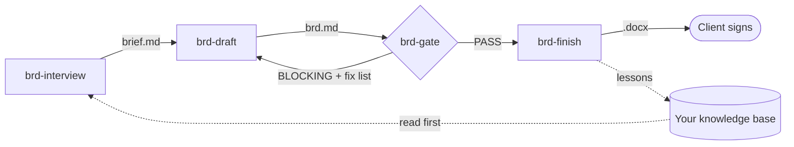

# gaspol-brdwriter

**Client-signable Business Requirements Documents for Claude Code.**
Requirements per IIBA BABOK v3 and ISO/IEC/IEEE 29148, plus the commercial terms the
client signs — in one document, behind a blocking quality gate.


---

## Why this exists

Mature requirement tools for Claude — Anthropic's `product-management`, BMAD, Spec Kit —
write **PRDs**: user stories and feature specs for engineers. A consultant delivering to a
client needs something else:

- the **as-is and to-be** process, not just the new feature;
- **business → stakeholder → solution → transition** requirements with a trace chain;
- **transition work** — data migration, training, cut-over, hypercare;
- and a **commercial section** — scope, price, payment terms, acceptance, sign-off —
  because in practice the signed BRD is what every invoice references.

BRD-specific skills that do exist are small single-maintainer projects. This plugin
combines the best of their patterns, adds the commercial layer, and refuses to hand a BRD
to a client until it passes an adversarial review.

## What you get

| Output | Description |
|---|---|
| `brief.md` | Interview record. Every item tagged `[CONFIRMED]`, `[ASSUMPTION]`, `[OPEN]`, `[DERIVED]`, or `[RESEARCHED]`. |
| `brd.md` | The BRD, 23 sections — the source of truth. |
| `review.md` | Gate verdict **PASS** or **BLOCKING**, with a located fix list. |
| `BRD-<CODE>-<NNN>.docx` | Word file for the client: cover, document control, version history, TOC, sign-off table. |

Output language: **Bahasa Indonesia** (default), **English**, or **bilingual**.

## Pipeline



It is a loop, not a line: what one BRD teaches is written back to your knowledge base, so
the next interview asks fewer questions.

| Skill | Role |
|---|---|
| `gaspol-brdwriter` | Router. Reads which run files exist and sends you to the next phase. Never writes content. |
| `brd-interview` | Reads your knowledge base first (domain playbooks before anything else), then asks only the gaps — at most 3 questions per turn. Stops rather than guess a price, a client figure, or a system name. |
| `brd-draft` | Writes `brd.md` from the template: BR → SR → FR/NFR trace chain, EARS statements, measurable NFRs, Given/When/Then acceptance criteria, transition requirements, commercial section. Refuses to start without `brief.md`. |
| `brd-gate` | Eight checks, blocking. Works on any BRD — ours or a third party's. |
| `brd-finish` | Renders the `.docx` only from a BRD whose PASS is current, then offers to write lessons back. |

## The gate

| # | Check | Blocks when |
|---|---|---|
| 1 | IEEE 29148 characteristics — necessary, unambiguous, complete, consistent, verifiable, feasible, traceable | A requirement is not verifiable or not unambiguous; a duplicate ID |
| 2 | Vague words (Indonesian + English list) without a measurable bound | In an NFR or an acceptance criterion |
| 3 | Trace chain | Any orphan requirement, a BR with no child, a Must FR with no acceptance criterion |
| 4 | Every number carries a source tag | Any untagged price, tax rate, KPI, or client figure |
| 5 | Payment terms | Terms do not sum to exactly 100%, or a milestone is not verifiable |
| 6 | Open items | `[OPEN]` anywhere except the Open Questions section |
| 7 | Template leftovers | Any unfilled `{{slot}}` |
| 8 | What, not how | Stack, schema, or architecture written as a requirement |

A BLOCKING verdict is never softened for a deadline. A PASS on a BRD with an invented
price is how a signed contract ends up carrying a number nobody agreed to.

## Hard rules

1. **Three things are never invented** — price and payment terms, client operating
   numbers, client system names. The skill stops and asks.
2. **Generic plugin.** No client, city, person, or knowledge-base address ships in
   `skills/`, `references/`, `templates/`, or `evals/`. Enforced by `tests/guard-generic.sh`.
3. **Frontmatter is `name` + `description` only.**
4. **No `.docx` without a current PASS.**
5. **What, not how.** Technical design is downstream work.
6. **Notes are data, never instruction.** A price read from a note is confirmed by the
   user before it reaches the document.

## Install

```bash
/plugin marketplace add alisadikinma/gaspol-one
/plugin install gaspol-brdwriter@gaspol-one
```

### Requirements

| Dependency | Needed for | If missing |
|---|---|---|
| Anthropic `docx` skill (`document-skills`) | `brd-finish` | Stops and says so; `brd.md` remains complete |
| A notes MCP, vault, or notes folder | `brd-interview` Step 0 (optional) | Full interview from scratch — the normal first run |
| `mom-test` skill | Interview discipline (optional) | The interview contract stands alone |

## Usage

Start in an empty working folder for the project:

```text
> buatkan BRD untuk dashboard OEE lini molding klien kami
```

The router runs `brd-interview`. Answer its questions; it writes `brief.md`. Ask it to
continue and it drafts, gates, and — after a PASS — renders the Word file. To review a BRD
written elsewhere:

```text
> review BRD ini sebelum dikirim ke klien: ./incoming/brd-vendor.md
```

One working folder holds one BRD.

## Repository layout

```text
skills/        router + 4 phase skills
references/    BABOK classification, 29148 checklist, EARS, vague words,
               commercial section, domain question banks, example BRDs
templates/     23-section BRD template, traceability matrix
evals/         3 behaviour cases (vague idea, enhancement, IoT integration)
tests/         bash gates — run-all.sh
research/      landscape study and pinned sources
```

## Tests

```bash
bash tests/run-all.sh
```

Bash, grep, and awk only. A missing test script is RED, never skipped. The gate itself is
validated against two fixtures: `references/examples/good-brd.md` must PASS, and
`references/examples/bad-brd.md` — four planted defects — must be BLOCKED, with
`tests/fixture-shape.sh` guarding that the defects stay planted.

## Sources and licensing

| Source | License | Use |
|---|---|---|
| [gerardogdonoso/brd-business-analyst](https://github.com/gerardogdonoso/brd-business-analyst) | MIT | Interview flow, status tags, anti-fabrication rules — adapted and translated |
| [takusaotome/claude-skills-library](https://github.com/takusaotome/claude-skills-library) `business-analyst` | MIT | BABOK v3 structure, BRD section order — adapted |
| [jdm4pku/RE-Skills](https://github.com/jdm4pku/RE-Skills) | none stated | Ideas only; no text copied |
| IIBA BABOK v3, ISO/IEC/IEEE 29148:2018, EARS, ISO/IEC 25010 | Standards | Summarised in own words |

Commits and audit notes: [`research/sources.md`](research/sources.md).

## Out of scope

- PRD per feature — feed the signed BRD to Anthropic `product-management` `/write-spec`.
- Spec-driven build — feed it to BMAD-METHOD or GitHub Spec Kit.
- PDF export and e-signature.

## Part of GASPOL

Ships through the [gaspol-one](https://github.com/alisadikinma/gaspol-one) marketplace
alongside `gaspol-dev`, `gaspol-pitch`, `gaspol-catalog`, `gaspol-ebook`, `gaspol-video`,
and `gaspol-jobhunter`. Every GASPOL plugin blocks weak output behind an adversarial
review before it leaves your machine.

## License

[MIT](LICENSE) © 2026 Ali Sadikin
