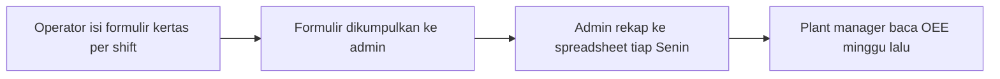
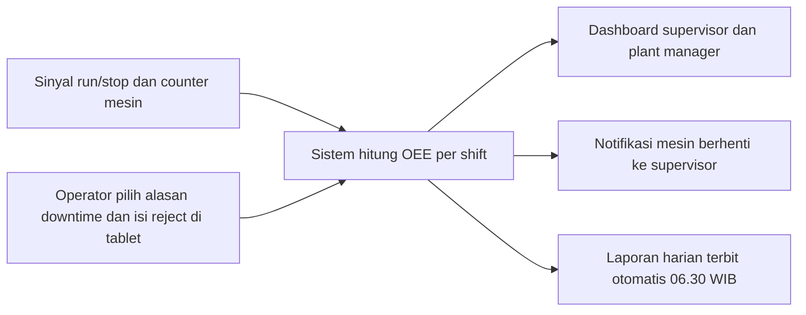

<!-- Fixture with 4 planted defects for brd-gate: untagged price (18.2), NFR-002 'cepat' with no bound, FR-009 with no parent, payment terms summing to 90%. Never fix them; tests/fixture-shape.sh guards them. -->

# Business Requirements Document — Dashboard OEE Lini Molding

**Nomor dokumen:** BRD-SCA-001
**Klien:** PT Sinar Contoh Abadi (fiktif — contoh untuk pengujian plugin)
**Penyedia:** PT Contoh Solusi Digital (fiktif)

## 0. Kendali Dokumen

| Field | Isi |
|---|---|
| Versi | 1.0 |
| Tanggal | 30 September 2026 |
| Status | Untuk review |
| Penyusun | Analis bisnis penyedia |
| Reviewer | Plant Manager, Kepala Engineering |
| Sumber brief | brief.md tanggal 29 September 2026 |

Riwayat versi:

| Versi | Tanggal | Perubahan | ID terdampak | Disetujui oleh |
|---|---|---|---|---|
| 1.0 | 30 September 2026 | Draft awal dari brief | — | — |

## 1. Ringkasan Eksekutif

PT Sinar Contoh Abadi mengoperasikan 24 mesin injection molding [src: brief Q3] dalam 3 shift
[src: brief Q4]. OEE saat ini 58% [src: brief Q6] dan dihitung manual dari kertas setiap
akhir minggu, sehingga penyebab berhenti mesin baru diketahui berhari-hari kemudian.

Proyek ini menyediakan dashboard OEE per mesin dan per shift, notifikasi mesin berhenti ke
supervisor, pencatatan alasan downtime oleh operator, dan laporan produksi harian otomatis.
Target: OEE 70% dalam 6 bulan setelah go-live [src: brief Q7].

Nilai proyek Rp 480.000.000 belum termasuk PPN [src: brief Q18], dibayar dalam 3 termin
yang terikat pada tanda tangan BRD, kelulusan UAT, dan BAST setelah hypercare.

## 2. Latar Belakang & Masalah

- Operator mencatat output, reject, dan jam berhenti di formulir kertas per shift
  [src: brief Q1].
- Admin produksi merekap formulir ke spreadsheet setiap Senin; rekap memakan sekitar
  6 jam kerja per minggu [src: brief Q2].
- Alasan downtime ditulis bebas, sehingga tidak bisa dikelompokkan. Akar masalah berhenti
  mesin tidak pernah dianalisis per kategori [src: brief Q9].
- Supervisor baru tahu mesin berhenti lama saat berkeliling lantai produksi.

## 3. Tujuan Bisnis & KPI

| KPI | Baseline | Target | Kapan diukur | Cara ukur |
|---|---|---|---|---|
| OEE rata-rata lini molding | 58% [src: brief Q6 — rekap manual Jan–Jun 2026] | 70% [src: brief Q7] | Bulan ke-6 setelah go-live | Rata-rata OEE harian dari dashboard selama satu bulan |
| Waktu rekap laporan produksi | 6 jam per minggu [src: brief Q2] | 0 jam per minggu [src: brief Q7] | Bulan ke-1 setelah go-live | Laporan harian terbit otomatis tanpa input admin |
| Downtime dengan alasan tercatat | 0% berkategori [src: brief Q9] | ≥ 95% berkategori [src: brief Q7] | Bulan ke-2 setelah go-live | Jumlah kejadian berhenti > 3 menit yang punya alasan ÷ total kejadian |

## 4. Lingkup

**Dalam lingkup:**

- Dashboard OEE untuk 24 mesin injection molding [src: brief Q3].
- Notifikasi mesin berhenti ke supervisor shift.
- Pencatatan alasan downtime dan jumlah reject oleh operator.
- Laporan produksi harian.
- Pelatihan pengguna, periode paralel, dan hypercare.

**Di luar lingkup:**

- Pengadaan dan pemasangan sensor serta perangkat pengambil sinyal mesin (disediakan klien
  melalui vendor terpisah) [src: brief Q5].
- Modul kualitas lanjutan (analisis jenis cacat), perencanaan produksi, dan perawatan
  prediktif.
- Tablet untuk operator (disediakan klien) [src: brief Q5].

## 5. Stakeholder & RACI

| Stakeholder | Peran | Kepentingan | R | A | C | I |
|---|---|---|---|---|---|---|
| Direktur Operasional | Sponsor | Kenaikan OEE, keputusan anggaran | | A | | |
| Plant Manager | Pemilik proses | Laporan OEE, prioritas perbaikan | R | | | |
| Supervisor shift | Pengguna | Tahu mesin berhenti, menindaklanjuti | | | C | I |
| Operator mesin | Pengguna | Mencatat alasan downtime dan reject | | | C | I |
| Admin produksi | Pengguna | Laporan harian tanpa rekap manual | | | C | I |
| Kepala Engineering | Pemilik data ideal cycle time | Kebenaran angka performance | | | C | |

## 6. Proses As-Is & To-Be

As-is:

To-be:

Gap (as-is → to-be):

- Pencatatan kertas diganti input tablet dan sinyal mesin.
- Rekap mingguan diganti perhitungan per shift.
- Alasan downtime bebas diganti daftar kategori baku (RULE-002).

## 7. Business Requirements

| ID | Pernyataan | Prioritas | Status |
|---|---|---|---|
| BR-001 | Menaikkan OEE rata-rata lini molding dari 58% menjadi 70% dalam 6 bulan setelah go-live [src: brief Q6, Q7]. | Must | [CONFIRMED] |
| BR-002 | Menghapus rekap manual laporan produksi. | Must | [CONFIRMED] |
| BR-003 | Mencatat penyebab downtime dalam kategori baku agar bisa dianalisis. | Must | [CONFIRMED] |
| BR-004 | Beralih ke sistem baru tanpa menghentikan produksi. | Must | [CONFIRMED] |

## 8. Stakeholder Requirements

| ID | Induk | Stakeholder | Pernyataan | Prioritas | Status |
|---|---|---|---|---|---|
| SR-001 | BR-001 | Supervisor shift | Supervisor perlu tahu mesin yang berhenti lebih dari 10 menit [src: brief Q10] tanpa berkeliling lantai produksi. | Must | [CONFIRMED] |
| SR-002 | BR-001 | Plant Manager | Plant manager perlu melihat OEE per mesin, per shift, dan per hari. | Must | [CONFIRMED] |
| SR-003 | BR-002 | Admin produksi | Admin produksi perlu laporan produksi harian tanpa menyalin data. | Must | [CONFIRMED] |
| SR-004 | BR-003 | Operator mesin | Operator perlu mencatat alasan downtime langsung di mesin. | Must | [CONFIRMED] |
| SR-005 | BR-004 | Plant Manager | Plant manager perlu produksi tetap tercatat selama peralihan. | Must | [CONFIRMED] |

## 9. Functional Requirements

| ID | Induk | Pernyataan (EARS) | MoSCoW | Status |
|---|---|---|---|---|
| FR-001 | SR-001 | Ketika mesin berhenti lebih dari 10 menit [src: brief Q10], sistem harus mengirim notifikasi ke supervisor shift yang sedang bertugas berisi ID mesin, jam berhenti, dan durasi. | Must | [CONFIRMED] |
| FR-002 | SR-002 | Sistem harus menghitung OEE per mesin per shift sesuai RULE-001. | Must | [CONFIRMED] |
| FR-003 | SR-002 | Sistem harus menampilkan OEE per mesin, per shift, dan per hari pada dashboard. | Must | [CONFIRMED] |
| FR-004 | SR-003 | Ketika jam menunjukkan 06.30 WIB [src: brief Q11], sistem harus menerbitkan laporan produksi hari sebelumnya berisi output, reject, dan downtime per mesin dalam format PDF dan Excel. | Must | [CONFIRMED] |
| FR-005 | SR-004 | Ketika mesin berhenti lebih dari 3 menit [src: brief Q9], sistem harus meminta operator di tablet mesin memilih satu alasan dari daftar alasan downtime baku (RULE-002). | Must | [CONFIRMED] |
| FR-006 | SR-004 | Selama alasan downtime sebuah kejadian berhenti belum dipilih, sistem harus menandai kejadian itu "alasan belum diisi" pada dashboard supervisor. | Should | [CONFIRMED] |
| FR-007 | SR-002 | Sistem harus mengizinkan plant manager mengekspor data OEE untuk rentang tanggal yang dipilih ke format Excel. | Should | [CONFIRMED] |
| FR-008 | SR-003 | Sistem harus mencatat jumlah produk baik dan jumlah reject per mesin per shift dari input operator. | Must | [CONFIRMED] |
| FR-009 | - | Jika sinyal sebuah mesin tidak diterima lebih dari 2 menit [src: brief Q12], maka sistem harus menampilkan mesin itu berstatus "tanpa data", terpisah dari status "berhenti". | Must | [CONFIRMED] |
| FR-010 | SR-005 | Selama periode paralel (TR-002), sistem harus menerima input manual output dan downtime untuk mesin yang sinyalnya belum terhubung. | Should | [CONFIRMED] |

## 10. Non-Functional Requirements

| ID | Induk | Kategori | Pernyataan terukur | MoSCoW | Status |
|---|---|---|---|---|---|
| NFR-001 | SR-002 | Performance efficiency | Dashboard harus menampilkan data shift berjalan dalam ≤ 3 detik (p95) dengan 30 pengguna bersamaan [src: brief Q13]. | Must | [CONFIRMED] |
| NFR-002 | SR-001 | Performance efficiency | Dashboard harus cepat. | Must | [CONFIRMED] |
| NFR-003 | SR-002 | Reliability | Sistem harus tersedia ≥ 99,5% per bulan, 24 jam, di luar perawatan terjadwal yang diumumkan ≥ 48 jam sebelumnya [src: brief Q14]. | Must | [CONFIRMED] |
| NFR-004 | SR-002 | Security | Hanya pengguna berperan Supervisor, Plant Manager, atau Admin produksi yang dapat mengekspor data; tiap ekspor tercatat di log audit berisi pengguna, waktu, dan rentang data [src: brief Q15]. | Must | [CONFIRMED] |
| NFR-005 | SR-003 | Maintainability | Data produksi harus disimpan minimal 5 tahun [src: brief Q16 — kebijakan arsip internal klien]. | Must | [CONFIRMED] |

## 11. Business Rules

| ID | Melayani | Aturan | Sumber | Status |
|---|---|---|---|---|
| RULE-001 | BR-001 | OEE = Availability × Performance × Quality. Availability tidak menghitung waktu perawatan terjadwal. | [src: brief Q8] | [CONFIRMED] |
| RULE-002 | BR-003 | Alasan downtime dipilih dari 12 kategori baku yang dikelola Plant Manager [src: brief Q9]. | [src: brief Q9] | [CONFIRMED] |
| RULE-003 | BR-001 | Ideal cycle time per produk ditetapkan oleh Kepala Engineering. | [src: brief Q8] | [CONFIRMED] |

## 12. Data & Integrasi

| ID | Melayani | Objek data / sistem | Arah | Frekuensi | Pemilik | Status |
|---|---|---|---|---|---|---|
| DI-001 | BR-002 | Pesanan produksi dari ERP klien "Odoo 17" [src: brief Q5] | ERP → sistem | Tiap 15 menit [src: brief Q5] | Tim IT klien | [CONFIRMED] |
| DI-002 | BR-001 | Sinyal run/stop dan counter dari 24 mesin [src: brief Q3] | Mesin → sistem | Tiap 10 detik [src: brief Q12] | Vendor sensor klien | [CONFIRMED] |

## 13. Transition Requirements

| ID | Melayani | Jenis | Pernyataan | Status |
|---|---|---|---|---|
| TR-001 | BR-004 | Pelatihan | Pelatihan operator dan supervisor: 2 sesi × 2 jam per shift sebelum go-live [src: brief Q17]. | [CONFIRMED] |
| TR-002 | BR-004 | Cut-over | Periode paralel 2 minggu [src: brief Q17]: formulir kertas tetap diisi; selisih output > 2% [src: brief Q17] antara kertas dan sistem ditelusuri sebelum formulir dihentikan. | [CONFIRMED] |
| TR-003 | BR-004 | Hypercare | Hypercare 30 hari setelah go-live [src: brief Q19]; insiden kritis direspons ≤ 4 jam kerja [src: brief Q19]. | [CONFIRMED] |

## 14. Asumsi, Batasan & Dependensi

| Jenis | Isi | Status |
|---|---|---|
| Asumsi | Klien menunjuk satu penanggung jawab data ideal cycle time sebelum UAT. | [CONFIRMED] |
| Batasan | Jaringan Wi-Fi lantai produksi dikelola tim IT klien. | [CONFIRMED] |
| Dependensi | Sensor dan perangkat sinyal mesin terpasang oleh vendor klien sebelum UAT. | [CONFIRMED] |
| Dependensi | Akses baca ke ERP "Odoo 17" dan lingkungan uji tersedia sebelum pengembangan DI-001. | [CONFIRMED] |

## 15. Risiko

| Risiko | Dampak | Kemungkinan | Mitigasi | Pemilik |
|---|---|---|---|---|
| Pemasangan sensor oleh vendor klien terlambat | Tinggi | Sedang | FR-010 memungkinkan input manual selama paralel | Plant Manager |
| Operator tidak mengisi alasan downtime | Sedang | Sedang | FR-006 menandai kejadian kosong; TR-001 pelatihan | Supervisor shift |
| Ideal cycle time tidak akurat | Tinggi | Sedang | RULE-003 menetapkan pemilik angka; ditinjau saat UAT | Kepala Engineering |

## 16. Kepatuhan

Sistem menyimpan nama pengguna dan log aktivitas karyawan. Data ini adalah data pribadi
menurut UU No. 27 Tahun 2022 tentang Pelindungan Data Pribadi. Pemrosesan terbatas pada
keperluan operasional produksi, dan akses log audit hanya untuk Plant Manager
[src: brief Q15].

## 17. Kriteria Penerimaan

| ID | Menguji | Given | When | Then |
|---|---|---|---|---|
| AC-001 | FR-001 | Mesin M-07 berstatus RUN pada shift pagi | Sinyal M-07 menunjukkan berhenti selama 11 menit | Supervisor shift pagi menerima notifikasi berisi M-07, jam berhenti, dan durasi 11 menit |
| AC-002 | FR-002 | Data shift pagi M-07 tercatat lengkap dan ideal cycle time produk sudah diisi | Shift pagi berakhir | OEE M-07 shift pagi sama dengan hasil hitung manual RULE-001 dengan selisih ≤ 0,1 poin |
| AC-003 | FR-003 | Data OEE tiga shift tersedia untuk 24 mesin | Plant manager membuka dashboard dan memilih tanggal kemarin | OEE tampil per mesin, per shift, dan per hari |
| AC-004 | FR-004 | Produksi hari sebelumnya tercatat | Jam menunjukkan 06.30 WIB | Laporan PDF dan Excel berisi output, reject, dan downtime per mesin tersedia untuk admin produksi |
| AC-005 | FR-005 | Mesin M-03 berstatus RUN | M-03 berhenti selama 4 menit | Tablet M-03 menampilkan daftar 12 kategori alasan downtime |
| AC-006 | FR-008 | Operator shift malam mengisi 950 baik dan 12 reject untuk M-11 | Shift malam berakhir | Laporan shift malam M-11 menunjukkan 950 baik dan 12 reject |
| AC-007 | FR-009 | Mesin M-15 mengirim sinyal normal | Sinyal M-15 tidak diterima selama 3 menit | Dashboard menampilkan M-15 berstatus "tanpa data", bukan "berhenti" |
| AC-008 | NFR-001 | 30 pengguna membuka dashboard bersamaan | Pengujian beban 15 menit dijalankan | Waktu tampil p95 ≤ 3 detik |

## 18. Komersial

### 18.1 Paket & Lingkup

Paket "Dashboard OEE Molding" mencakup BR-001 sampai BR-004 beserta seluruh SR, FR, NFR,
RULE, DI, dan TR dalam dokumen ini. Tidak termasuk hal yang tercantum di bagian 4 "Di luar
lingkup".

### 18.2 Harga

Rp 480.000.000 belum termasuk PPN. PPN dikenakan sesuai tarif yang
berlaku pada tanggal faktur; tarif saat penawaran ini 12% [src: brief Q18]. Tidak ada biaya
berulang pada tahun pertama; biaya dukungan tahun kedua ditawarkan terpisah [src: brief Q18].

### 18.3 Termin Pembayaran

| Termin | % | Nilai | Milestone | Bukti milestone |
|---|---|---|---|---|
| T1 | 30% | Rp 144.000.000 [src: brief Q18] | BRD versi final ditandatangani kedua pihak | BRD bertanda tangan |
| T2 | 40% | Rp 192.000.000 [src: brief Q18] | UAT lulus | Berita acara UAT ditandatangani Plant Manager |
| T3 | 20% | Rp 96.000.000 [src: brief Q18] | Hypercare 30 hari selesai | BAST ditandatangani Direktur Operasional |

Invoice jatuh tempo 14 hari kalender sejak diterima [src: brief Q18].

### 18.4 Penerimaan

UAT berlangsung 10 hari kerja [src: brief Q19] dan ditandatangani Plant Manager. Hanya cacat
berkategori Kritis (fungsi Must tidak berjalan) dan Tinggi (fungsi Must berjalan dengan hasil
salah) yang menahan penerimaan. Bila dalam 10 hari kerja klien tidak menandatangani dan tidak
menyerahkan daftar cacat, UAT dianggap lulus [src: brief Q19]. Kriteria penerimaan ada di
bagian 17.

### 18.5 Perubahan Lingkup

Permintaan perubahan diajukan tertulis oleh Plant Manager, diestimasi penyedia dalam 5 hari
kerja [src: brief Q19], dan berlaku setelah addendum ditandatangani kedua pihak.

### 18.6 Garansi & Hypercare

Hypercare 30 hari setelah go-live (TR-003). Garansi perbaikan cacat terhadap persyaratan
dokumen ini selama 90 hari setelah BAST [src: brief Q19].

### 18.7 Masa Berlaku Penawaran

Harga dan termin berlaku sampai 31 Oktober 2026 [src: brief Q18].

## 19. Matriks Keterlusuran

| BR | SR | FR/NFR | RULE | TR | Test/AC |
|---|---|---|---|---|---|
| BR-001 | SR-001 | FR-001, FR-009, NFR-002 | — | — | AC-001, AC-007 |
| BR-001 | SR-002 | FR-002, FR-003, FR-007, NFR-001, NFR-003, NFR-004 | RULE-001, RULE-003 | — | AC-002, AC-003, AC-008 |
| BR-002 | SR-003 | FR-004, FR-008, NFR-005 | — | — | AC-004, AC-006 |
| BR-003 | SR-004 | FR-005, FR-006 | RULE-002 | — | AC-005 |
| BR-004 | SR-005 | FR-010 | — | TR-001, TR-002, TR-003 | — |

## 20. Glosarium

| Istilah | Arti |
|---|---|
| OEE | Overall Equipment Effectiveness = Availability × Performance × Quality (RULE-001) |
| Downtime | Waktu mesin berhenti di luar perawatan terjadwal |
| Ideal cycle time | Waktu siklus tercepat per produk, ditetapkan Kepala Engineering |
| BAST | Berita Acara Serah Terima |
| Hypercare | Masa pendampingan intensif setelah go-live |

## 21. Pertanyaan Terbuka

| No | Pertanyaan | Siapa menjawab | Tenggat | Status |
|---|---|---|---|---|
| 1 | Apakah fase berikutnya mencakup modul kualitas (analisis jenis cacat)? Bukan bagian komitmen dokumen ini. | Direktur Operasional | 31 Desember 2026 | [OPEN] |

## 22. Persetujuan

| Pihak | Nama | Jabatan | Tanggal | Tanda tangan |
|---|---|---|---|---|
| Klien | Budi Contoh | Direktur Operasional | | |
| Penyedia | Sari Contoh | Direktur | | |
